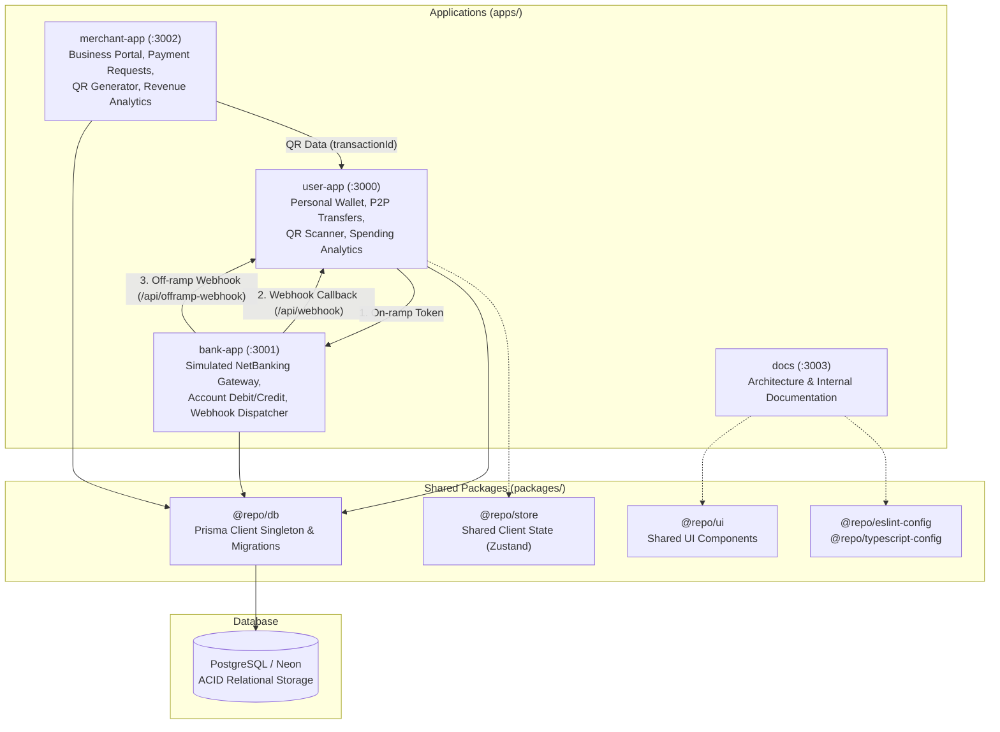

# PayPulse

PayPulse is a full-stack digital payments platform inspired by applications such as Paytm, designed to explore wallet transactions, merchant payments, simulated banking integrations, analytics, and payment-system engineering. Built as a TypeScript monorepo using Turborepo, Next.js, and PostgreSQL, the project models real-world payment lifecycles across distinct consumer, merchant, and banking domains.

**Repository:** [https://github.com/Darshit9696/PaytmAdvanced](https://github.com/Darshit9696/PaytmAdvanced)

---

## Highlights

- **P2P Wallet Transfers** — Executes balance transfers between users within transactional database boundaries and dispatches reciprocal transaction notifications.
- **Simulated Bank On-Ramp & Off-Ramp** — External banking gateway (`bank-app`) that issues tokenized deposit and payout sessions settled through asynchronous webhook callbacks.
- **Merchant QR Payments** — Generates transaction-specific SVG QR codes with customer checkout powered by in-browser camera scanning (`html5-qrcode`) and multi-pass image upload decoding (`jsqr`).
- **Financial & Merchant Analytics** — Aggregates monthly spend/income, category breakdowns, and top recipients for consumers, alongside 7-day revenue velocity and payment success metrics for merchants.
- **Session & Identity Isolation** — Separates personal user and business merchant accounts using role-specific NextAuth JWT sessions and isolated session cookies to avoid collision during local development.
- **Shared Database Client Package** — Centralizes Prisma schema migrations and client instantiation in a shared package with global connection pooling to prevent exhaustion across Next.js Fast Refresh cycles.

---

## Architecture

The system is organized as a Turborepo monorepo dividing responsibilities across three functional applications and shared packages. Each application runs independently to model distinct domains (consumer wallet, external bank gateway, and merchant portal).



### Why Multiple Applications?

- **Domain Separation:** Consumer balances, merchant settlements, and banking operations represent three distinct trust boundaries. Running them as isolated applications prevents accidental coupling of internal logic.
- **Simulating External Integrations:** In a production payments architecture, the bank net banking gateway and merchant terminals are external third parties. Running `bank-app` on a separate port (`3001`) replicates realistic redirect, settlement, and webhook callback mechanics.
- **Independent Auth Boundaries:** User and merchant personas maintain completely different onboarding flows, credential structures, and session lifetimes.

---

## Core Payment Flows

### 1. Peer-to-Peer (P2P) Transfer

Enables authenticated users to send funds directly to another user's wallet.

```text
User 
  → POST /api/transfer 
  → Validate session (USER role only) & verify recipient
  → Check sender balance
  → prisma.$transaction
      ├── Increment receiver wallet
      ├── Decrement sender wallet
      ├── Insert Transaction passbook record
      └── Insert dual Notifications (TRANSFER_SENT, TRANSFER_RECEIVED)
  → Return transfer confirmation
```

Inside [`apps/user-app/app/api/transfer/route.ts`](file:///d:/paytm-advanced-app/apps/user-app/app/api/transfer/route.ts), balance updates and ledger creation execute inside an interactive `prisma.$transaction`. *Note: The preliminary balance check currently occurs before entering the transaction block; see [Current Reliability Limitations](#current-reliability-limitations--roadmap) for the planned row-locking improvements.*

### 2. Bank On-Ramp (Deposit)

Simulates depositing money from an external bank account into the user's wallet via a bank gateway and webhook callback.

```text
User initiates deposit in user-app
  → POST /api/onramp
  → Generate UUID token & insert OnRampTransaction (status: "Processing")
  → Redirect user to bank gateway (bank-app:3001/pay?token=...)
  → User confirms bank payment
  → POST bank-app:3001/api/pay
      ├── Verify mock BankAccount balance >= amount
      ├── prisma.$transaction: Decrement BankAccount & mark OnRampTransaction as "Success"
      └── Dispatch server-to-server POST to user-app:3000/api/webhook
  → user-app:3000/api/webhook receives token
  → Validates status == "Success" & increments User Wallet
```

### 3. Bank Off-Ramp (Payout / Withdrawal)

Enables users to withdraw funds from their digital wallet back to their linked bank account.

```text
User initiates withdrawal in user-app
  → POST /api/off-ramp
  → Validate balance & insert OffRampTransaction (status: "Processing", UUID token)
  → Redirect user to bank payout interface (bank-app:3001/payout?token=...)
  → User confirms payout
  → POST bank-app:3001/api/payout
      ├── prisma.$transaction:
      │     ├── Conditional atomic wallet decrement (balance >= amount)
      │     ├── Increment BankAccount balance
      │     └── Update OffRampTransaction status to "Success"
      └── Dispatch server-to-server POST to user-app:3000/api/offramp-webhook
  → user-app:3000/api/offramp-webhook confirms settlement
```

### 4. Merchant QR Payment

Supports in-person and dynamic QR-based merchant checkout.

```text
Merchant enters amount & note in merchant-app
  → POST /api/merchant/transaction
  → Generates UUID transactionId & inserts MerchantTransaction (status: PENDING)
  → Renders dynamic SVG QR code (qrcode.react) containing checkout URL
User scans QR via camera (html5-qrcode) OR uploads image/screenshot (jsqr)
  → user-app decodes URL and redirects to /pay?transactionId=...
  → GET /api/payment fetches merchant name and requested amount
User authorizes payment
  → POST /api/payment
  → prisma.$transaction:
      ├── Re-verify MerchantTransaction is still PENDING (prevents double payment)
      ├── Decrement User Wallet (ensuring non-negative balance)
      ├── Increment Merchant balance
      ├── Update MerchantTransaction to SUCCESS (links customerId)
      └── Create corresponding Transaction history record
```

---

## Engineering Decisions

### Atomic Multi-Step Operations (`prisma.$transaction`)
Financial transfers require all-or-nothing guarantees. The platform wraps balance mutators and record creation in Prisma interactive transactions so that failures (such as missing accounts or invalid states) abort without leaving balances out of sync. For example, in merchant checkout (`/api/payment`), the status is re-read inside the transaction block; if another request has already settled the transaction, the entire block rolls back.

### User & Merchant Session Isolation
Running both user and merchant applications on `localhost` during development introduces cookie collisions when using default cookie names. PayPulse configures dedicated session cookie names:
- `user-app`: `next-auth.user-session-token` (Role: `USER`)
- `merchant-app`: `next-auth.merchant-session-token` (Role: `MERCHANT`)

API endpoints in each app enforce role validation (`session.user.role`), preventing merchant credentials from executing consumer transfers or accessing private user analytics.

### Webhook-Driven Settlement Architecture
Rather than mutating wallet balances directly from the client after a bank page redirect, the application models asynchronous bank webhooks. The simulated bank gateway processes the withdrawal from the mock bank ledger, marks the transaction record, and delivers a server-to-server HTTP POST payload to `user-app/api/webhook`. This decouples client redirection from monetary settlement.

### Prisma Connection Pooling via Singleton Pattern
Next.js development mode uses Fast Refresh, re-evaluating modules on hot reload. Uncontrolled instantiation (`new PrismaClient()`) would spawn new database connection pools on each reload, exhausting PostgreSQL connection limits. [`packages/db/src/index.ts`](file:///d:/paytm-advanced-app/packages/db/src/index.ts) caches the Prisma client on `globalThis`, pinning the pool to a single persistent instance in development.

### Monorepo Architecture with Turborepo
Common logic is extracted into shared packages:
- `@repo/db`: Single source of truth for the database schema, Prisma migrations, and typed client exports.
- `@repo/store`: Shared Zustand store hooks for state experiments.
- `@repo/ui`, `@repo/eslint-config`, `@repo/typescript-config`: Shared component interfaces and linting standards.

---

## Current Reliability Limitations & Roadmap

A critical part of payments engineering is understanding system boundaries and failure modes. Below is the accurate tracking of current implementation status, known edge cases, and prioritized engineering improvements:

### Implemented Functionality
- [x] Turborepo monorepo setup with shared `@repo/db` client singleton
- [x] Dual-portal NextAuth authentication (phone + password for users, email + password for merchants)
- [x] Cookie and session role isolation between user and merchant portals
- [x] P2P wallet transfers with atomic sender decrement and receiver increment
- [x] Real-time transaction notifications (`TRANSFER_SENT`, `TRANSFER_RECEIVED`)
- [x] Simulated bank on-ramp with token creation, bank net banking gateway, and webhook listener
- [x] Simulated bank off-ramp with conditional wallet balance debit and confirmation webhook
- [x] Merchant dynamic QR payment requests with unique UUID transaction identifiers
- [x] Dual QR scanner: live camera stream (`html5-qrcode`) and canvas image upload decoding (`jsqr`)
- [x] Merchant checkout flow with double-charge prevention (`PENDING` state verification)
- [x] Offset-paginated transaction history and case-insensitive user search
- [x] User personal spending analytics (monthly spending/income, category breakdown, top peers)
- [x] Merchant dashboard analytics (7-day revenue velocity chart, success rate, day/month comparisons)

### In Progress
- [ ] **Shared State Store Adoption (`@repo/store`):** The Zustand store package exists, but UI pages currently manage balance state via server components and route queries.

### Planned Reliability & Security Roadmap
- [ ] **Pessimistic Row Locking (`SELECT ... FOR UPDATE`):** P2P transfers currently check user balance before entering the transaction block. Under high-frequency concurrent requests, a race condition could permit overdrafts before the balance decrements.
- [ ] **Transfer Idempotency Keys:** Introduce client-provided idempotency keys on `/api/transfer` and `/api/payment` to guard against duplicate submissions from network retries.
- [ ] **Webhook Idempotency & Settled State Tracking:** Currently, `/api/webhook` verifies `status === "Success"` but does not mark an explicit `settledAt` flag on `OnRampTransaction`. Re-delivered webhook payloads could increment user balances multiple times.
- [ ] **Cryptographic Webhook Signatures (HMAC-SHA256):** Replace token-based webhook payloads with cryptographically signed payloads and replay-resistant timestamps.
- [ ] **Append-Only Double-Entry Ledger:** Transition from mutable balance columns to an immutable ledger where balances are computed from credits and debits.
- [ ] **Automated Test Suite:** Add unit tests for monetary calculations, concurrency integration tests, and Playwright E2E flows for the QR checkout lifecycle.
- [ ] **API Rate Limiting:** Implement token-bucket rate limiting via Redis/Upstash on transfer, payment, and authentication endpoints.
- [ ] **Docker Orchestration & CI Pipeline:** Containerize applications with `docker-compose` and set up GitHub Actions for automated type-checking, linting, and migration tests.

---

## Tech Stack

| Category | Technologies |
| :--- | :--- |
| **Framework & Core** | Next.js 16 (App Router), React 19, TypeScript 5 |
| **Styling & Icons** | Tailwind CSS 4, Lucide React |
| **Database & ORM** | PostgreSQL (Neon Serverless), Prisma ORM 6 |
| **Authentication** | NextAuth.js v4 (JWT strategy), bcrypt (salted hashing) |
| **QR Code Engine** | `qrcode.react` (SVG generator), `html5-qrcode` (camera stream), `jsqr` (image decoder) |
| **Monorepo & Tooling**| Turborepo 2, npm workspaces, ESLint 9 |

---

## Repository Structure

```text
paytm-advanced-app/
├── apps/
│   ├── user-app/            # Port 3000: Consumer wallet, P2P transfer, QR scan & pay, analytics
│   ├── bank-app/            # Port 3001: Simulated HDFC NetBanking gateway & webhook dispatcher
│   ├── merchant-app/        # Port 3002: Merchant portal, payment requests, dynamic QR, revenue charts
│   └── docs/                # Port 3003: Monorepo documentation viewer
├── packages/
│   ├── db/                  # Centralized Prisma schema, migrations, and client singleton
│   ├── store/               # Shared client state management (Zustand hooks)
│   ├── ui/                  # Shared React UI components
│   ├── eslint-config/       # Workspace ESLint presets
│   └── typescript-config/   # Shared TypeScript configurations
├── package.json             # Root workspace scripts and dependencies
└── turbo.json               # Turborepo task pipeline definition
```

---

## Getting Started

### Prerequisites

- **Node.js:** `>= 18.0.0`
- **npm:** `>= 10.0.0`
- **PostgreSQL Database:** A running PostgreSQL instance or cloud database (e.g., [Neon](https://neon.tech/))

### 1. Clone & Install Dependencies

```bash
git clone https://github.com/Darshit9696/PaytmAdvanced.git
cd PaytmAdvanced
npm install
```

### 2. Configure Environment Variables

Create `.env` files in the respective package and application directories:

#### Database (`packages/db/.env`)
```env
DATABASE_URL="postgresql://<username>:<password>@<host>/<database>?sslmode=require"
```

#### User Application (`apps/user-app/.env.local`)
```env
NEXTAUTH_URL="http://localhost:3000"
NEXTAUTH_SECRET="your-development-user-nextauth-secret"
USER_APP_WEBHOOK_URL="http://localhost:3000/api/webhook"
USER_APP_OFFRAMP_WEBHOOK_URL="http://localhost:3000/api/offramp-webhook"
```

#### Bank Application (`apps/bank-app/.env.local`)
```env
USER_APP_WEBHOOK_URL="http://localhost:3000/api/webhook"
USER_APP_OFFRAMP_WEBHOOK_URL="http://localhost:3000/api/offramp-webhook"
```

#### Merchant Application (`apps/merchant-app/.env.local`)
```env
NEXTAUTH_URL="http://localhost:3002"
NEXTAUTH_SECRET="your-development-merchant-nextauth-secret"
```

### 3. Generate Prisma Client & Run Migrations

From the repository root:

```bash
# Generate the Prisma client
npm run --workspace=@repo/db db:generate

# Apply database migrations
npm run --workspace=@repo/db db:migrate
```

### 4. Run Development Servers

Start all applications concurrently via Turborepo:

```bash
npm run dev
```

| Application | Local URL | Description |
| :--- | :--- | :--- |
| **User App** | `http://localhost:3000` | Personal wallet, P2P transfers, scan & pay, analytics |
| **Bank Gateway** | `http://localhost:3001` | Simulated HDFC NetBanking on-ramp and off-ramp portal |
| **Merchant App** | `http://localhost:3002` | Merchant business portal, QR generator, velocity metrics |
| **Docs App** | `http://localhost:3003` | Monorepo architecture and internal documentation |

To run a specific application individually:

```bash
npm run dev --workspace=user-app
npm run dev --workspace=bank-app
npm run dev --workspace=merchant-app
```

---

## Screenshots / Demo

> Visual walkthroughs, UI preview recordings, and architecture workflow diagrams can be linked here.

---

## Project Status

PayPulse is under active development. Core transaction flows, authentication, merchant QR integration, and simulated banking webhooks are fully implemented. Next development iterations focus on distributed systems reliability: conditional row-locking, webhook replay prevention, cryptographic HMAC verification, and integration test coverage.

---

## License

This project is licensed under the [ISC License](LICENSE).